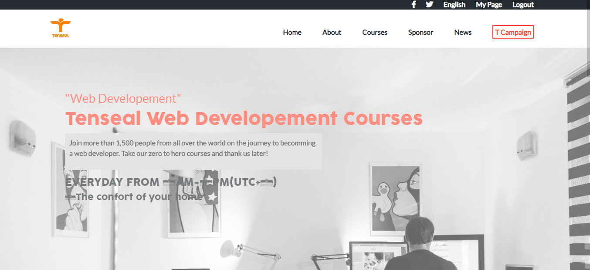

# Tenseal Platform

> Microverse Project: HTML and CSS Capstone Project

## Built With

- HTML,
- CSS
- Bootstrap

## Live Demo

[Live Demo Link](https://rawcdn.githack.com/tGodson/HTML-and-CSS-Capstone-Project/a89b482ffd3cbf5c0d81ffcf470300fbe698e66c/index.html)

## Short description

- This is an MVP project which is based on building the UX/UI of a platform where some web development Courses can be purchased.
- This project showcases the index page, the about us page and the Courses page which displays all the available courses.

## Installing

A step by step explaination that tells you how to get a development env running

- Follow [this link](https://github.com/tGodson/HTML-and-CSS-Capstone-Project) the to the repository
- Click on the green Clone or download button on the right
- choose the Download Zip option
- go to your downloads folder on you device and there you will find the zipped repo
- to unzip it, right click on the repo and extract the files to your prefered location
- go to the location of your extracted files and there you will see ther repo folder
- double click on the folder and you will see the repo files on which you can work on

👤 **Author**

- Github: [@tGodson](https://github.com/tGodson)
- Twitter: [@tendongze-godson](https://twitter.com/tendongze-godson)
- Linkedin: [linkedin](https://linkedin.com/in/tendongze95)

## 🤝 Contributing

Contributions, issues and feature requests are welcome!

Feel free to check the [issues page](https://github.com/tGodson/HTML-and-CSS-Capstone-Project/issues).

## Show your support

Give a ⭐️ if you like this project!

## Acknowledgments

- This project was first Designed by [Cindy Shin in Behance](https://www.behance.net/adagio07)

## 📝 License

This project is [Creative Commons Corporation](https://creativecommons.org/licenses/by-nc/4.0/legalcode) licensed.
